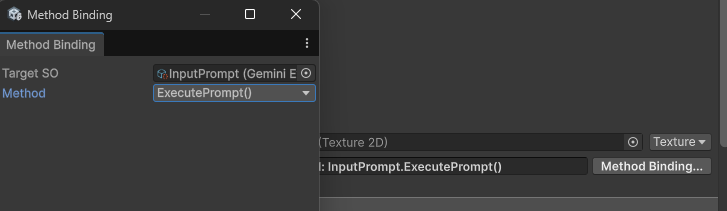

# EventButton Method Binding

Unity UI Toolkit의 `Button`에서 C# 메서드를 선택하고 호출할 수 있도록 만든 메서드 바인딩 시스템입니다.

기본 `Button.clicked`는 C# 코드에서 콜백을 직접 등록해야 합니다. `EventButton`은 UI Builder에서 호출 대상과 메서드를 선택하고, 해당 정보를 UXML에 저장한 뒤 클릭 시 런타임에서 실행할 수 있도록 확장했습니다.

## Tech Stack

- Unity 6
- C#
- UI Toolkit
- UI Builder
- UXML
- Unity Properties
- Unity Editor Extension
- Reflection
- ScriptableObject
- AssetDatabase / GUID
- Undo / Redo

## 주요 기능

- UI Builder에서 호출 대상과 메서드 선택
- 호출 가능한 `void` 메서드 자동 필터링
- 메서드 오버로드 구분
- 파라미터 타입에 맞는 Argument 입력
- ScriptableObject GUID 기반 Target 저장
- EditorWindow와 일반 객체를 위한 fallback Target 지원
- 바인딩 변경 Undo / Redo 지원
- 호출 실패와 Reflection 예외 로그 처리

## Method Binding



Method Binding 창에서는 다음 순서로 버튼 동작을 연결합니다.

1. 메서드를 제공할 `ScriptableObject`를 선택합니다.
2. 호출 가능한 메서드를 목록에서 선택합니다.
3. 메서드에 파라미터가 있다면 타입에 맞는 Argument를 입력합니다.
4. 선택한 정보는 UXML의 바인딩 데이터로 저장됩니다.
5. `EventButton` 클릭 시 저장된 메서드가 실행됩니다.

위 예시에서는 `InputPrompt`의 `ExecutePrompt()` 메서드를 버튼에 연결했습니다.

## 실행 흐름

```text
UI Builder
→ Target 선택
→ Method 선택
→ Argument 입력
→ MethodInvoker 직렬화
→ EventButton 클릭
→ Target 탐색
→ Method 탐색
→ Argument 타입 변환
→ MethodInfo.Invoke()
```

`EventButton`은 클릭과 바인딩 데이터만 관리합니다. Target 탐색, 메서드 검색, 인자 변환과 호출은 `RuntimeInvokeUtility`에 위임합니다.

```csharp
public void InvokeSelf()
{
    var invoker = Invoker;

    InvokeRequested?.Invoke(this, invoker);
    RuntimeInvokeUtility.InvokeTarget(Target, this, invoker);
}
```

## 지원 메서드

다음 조건을 만족하는 인스턴스 메서드를 바인딩할 수 있습니다.

- 반환형이 `void`
- Generic 메서드가 아님
- 특수 메서드가 아님
- 파라미터가 없거나 지원 타입의 파라미터 하나를 가짐

지원하는 파라미터:

- `string`
- `int`, `long`, `float`, `double`
- `bool`
- `enum`
- `UnityEngine.Object`
- `VisualElement`

메서드는 이름만 저장하지 않고 파라미터 타입을 포함한 Signature로 저장해 오버로드를 구분합니다.

```text
ExecutePrompt()
SetCount(System.Int32)
SetMode(MyNamespace.PromptMode)
```

## Target 처리

Target은 다음 순서로 탐색합니다.

1. 저장된 GUID를 통해 Unity Asset을 탐색합니다.
2. Asset을 찾지 못하면 `EventButton.Target`을 사용합니다.
3. Target 또는 Method를 찾지 못하면 호출을 중단하고 경고를 출력합니다.

ScriptableObject는 GUID로 저장할 수 있지만, `EditorWindow`나 일반 C# 객체는 에셋 GUID를 가질 수 없습니다. 이런 대상은 fallback Target으로 연결합니다.

```csharp
void CreateGUI()
{
    EventButtonBinder.BindAll(rootVisualElement, this);
}

void OnDisable()
{
    EventButtonBinder.UnbindAll(rootVisualElement);
}

void ExecutePrompt()
{
    // EventButton에서 호출
}
```

## Argument 변환

UI Builder에서 입력한 Argument는 UXML에 문자열로 저장됩니다. 실행 시 선택된 메서드의 파라미터 타입을 기준으로 실제 값으로 변환합니다.

```text
"10"    → int
"0.5"   → float
"True"  → bool
"Run"   → enum
GUID    → UnityEngine.Object
```

변환할 수 없는 값은 메서드를 호출하지 않고 경고를 출력합니다.

## 코드 구조

```text
Binding/
├─ EventButton.cs
├─ RuntimeInvokeUtility.cs
├─ PropertyBinding.cs
├─ ReflectionBindingUtility.cs
├─ Editor/
│  └─ EventButtonBindingEditor.cs
├─ docs/
│  └─ method-binding-window.png
└─ README.md
```

### `EventButton.cs`

메서드 호출 정보를 보관하고 클릭 시 실행을 요청하는 커스텀 UI Toolkit 버튼입니다.

다음 클래스가 포함되어 있습니다.

- `MethodInvoker`
- `EventButton`
- `EventButtonBinder`

### `RuntimeInvokeUtility.cs`

EventButton의 런타임 실행을 담당합니다.

- GUID 및 fallback Target 해석
- Reflection 기반 메서드 탐색
- Method Signature 생성
- Argument 타입 변환
- Unity Asset 로드
- 호출 및 예외 처리

### `Editor/EventButtonBindingEditor.cs`

UI Builder에서 Method Binding을 편집하기 위한 에디터 코드입니다.

다음 클래스가 포함되어 있습니다.

- `UIBuilderMethodBindingInjector`
- `EventButtonBindingWindow`

UI Builder Inspector에 `Method Binding...` 버튼을 추가하고 Target, Method, Argument를 선택할 수 있는 창을 제공합니다.

> UI Builder 내부 VisualTree를 탐색하는 보조 기능이므로 Unity 버전 변경 시 Inspector 구조를 다시 확인해야 합니다.

### `PropertyBinding.cs`

객체의 프로퍼티 경로를 UI 요소에 연결합니다. EventButton이 사용자 입력에 따른 메서드 호출을 담당한다면, PropertyBinding은 객체 상태를 UI에 표시하는 역할을 담당합니다.

### `ReflectionBindingUtility.cs`

PropertyBinding에서 사용하는 공통 Reflection 처리 계층입니다.

- 필드와 프로퍼티 탐색
- 중첩 경로 처리
- 컬렉션 인덱스 접근
- 값 읽기와 쓰기
- 타입 변환

## 사용 예시

UI Builder에서 `EventButton`을 배치한 뒤 `Method Binding...` 버튼을 눌러 Target과 Method를 선택합니다.

```xml
<act:EventButton text="Execute" />
```

실제 Target GUID, Method Signature, Argument 정보는 Method Binding 창에서 생성되어 UXML에 저장됩니다.
