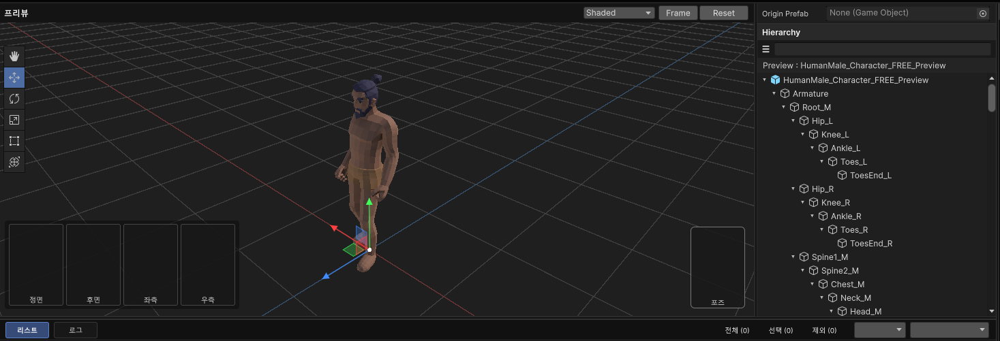
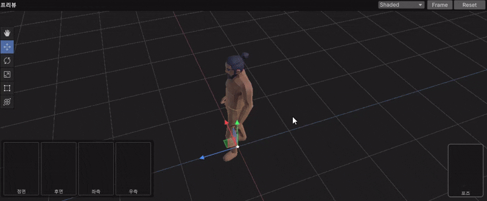
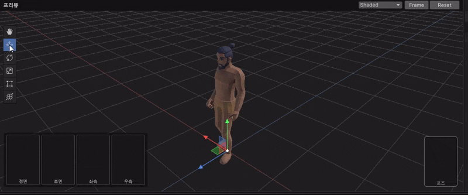
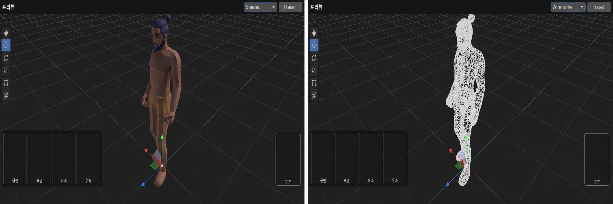
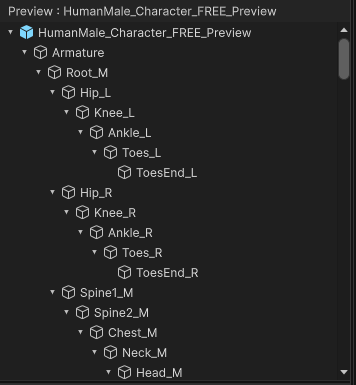
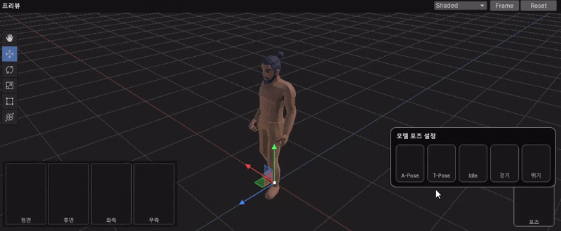
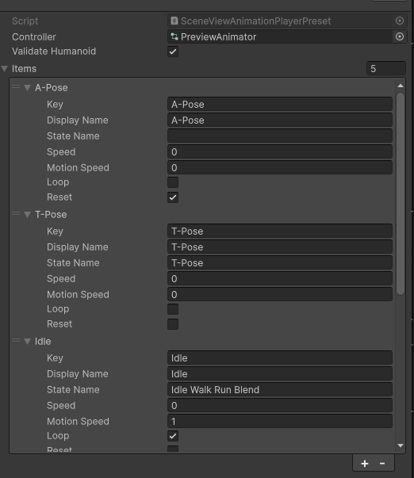

# UI Toolkit 기반 3D Preview Editor

Unity UI Toolkit의 `VisualElement` 안에 독립적인 3D Preview Scene을 구성하고, 모델 확인부터 Hierarchy 탐색, Transform 편집, 애니메이션 재생까지 하나의 에디터 UI로 통합한 Preview 시스템입니다.

실제 Unity Scene을 변경하지 않고 ACT Tool 내부에서 생성 대상 Prefab과 모델의 구조, 외형, Transform, 애니메이션 상태를 확인하기 위해 구현했습니다.



> [이미지 필요: ACT Tool 안에서 SceneViewElement, Hierarchy, Animation Player가 함께 표시된 전체 화면]  
> 경로: `docs/preview-overview.png`

## Tech Stack

- Unity 6
- C#
- UI Toolkit
- UI Builder
- UXML / USS
- Editor Preview Scene
- `EditorSceneManager.NewPreviewScene`
- `RenderTexture`
- `IMGUIContainer`
- `Handles`
- `PlayableGraph`
- `AnimationClipPlayable`
- Animator Controller
- ScriptableObject Preset
- Unity Properties
- Editor Lifecycle Management

## 주요 기능

- 실제 Scene과 분리된 Preview Scene 생성
- Prefab 및 GameObject 복제
- Preview 전용 Camera와 Light 구성
- Orbit, Pan, Zoom 카메라 조작
- Front, Back, Left, Right, Top 방향 전환
- Move, Rotate, Scale, Rect, Transform 도구
- Shaded / Wireframe 전환
- Grid 표시
- 모델 Bounds 기반 Frame
- Preview Object 선택
- Hierarchy 검색, 확장, 선택, Drag
- Animator Controller State 재생
- AnimationClip 직접 샘플링과 반복 재생
- Preview 구성 요소 간 `PreviewChannel` 동기화
- Panel Attach / Detach와 Editor Resource 정리

## 구성 구조

```text
SceneViewElement
├─ PreviewSceneController
│  ├─ Preview Scene
│  ├─ Camera
│  ├─ Key / Fill Light
│  ├─ RenderTexture
│  ├─ Preview Model
│  ├─ Grid
│  └─ Wireframe Object
├─ SceneViewElementUtility
│  ├─ Transform Handle Draw
│  ├─ Handle Picking
│  ├─ Move / Rotate / Scale 계산
│  └─ Tool Overlay
├─ SceneHierarchyPanel
├─ SceneViewAnimationPlayer
└─ SceneViewAnimationPlayerPreset
```

각 UI 요소는 `PreviewChannel`을 공유하며 동일한 Preview Object를 기준으로 상태를 동기화합니다.

```text
SceneViewElement
      ↓ Preview Object 변경
PreviewChannel
   ├─ SceneHierarchyPanel 갱신
   ├─ SceneViewAnimationPlayer Animator 재연결
   └─ Preview Repaint 요청
```

## Preview 전체 구성


> [이미지 필요: Preview 구성 요소를 번호로 표시한 화면 — Toolbar, Transform Tool Overlay, Direction Buttons, Grid, Hierarchy, Animation Controls]  
> 경로: `docs/preview-components.png`

## SceneViewElement

`SceneViewElement`는 Preview UI의 중심이 되는 커스텀 `VisualElement`입니다.

```csharp
[UxmlElement]
public partial class SceneViewElement : VisualElement, IDisposable
{
    readonly IMGUIContainer imguiContainer;
    readonly IMGUIContainer toolOverlayContainer;
    readonly PreviewSceneController preview = new();

    [UxmlAttribute, CreateProperty]
    public GameObject Model
    {
        get => model;
        set
        {
            if (model == value) return;

            model = value;

            if (IsActiveOnPanel())
                RebuildPreviewModel();
        }
    }
}
```

UI Toolkit은 Toolbar, Viewport, Direction Overlay와 레이아웃을 담당하고, 3D 렌더링과 Handle 입력은 `IMGUIContainer`에서 처리합니다.

```text
UI Toolkit
├─ Toolbar
├─ Viewport Layout
└─ Direction Overlay

IMGUIContainer
├─ RenderTexture 출력
├─ Mouse Input
├─ Transform Handle
└─ Tool Overlay
```

### UXML 속성

`SceneViewElement`는 UI Builder에서 다음 항목을 설정할 수 있습니다.

- Title
- Model
- Preview Channel
- Grid 표시 여부
- Direction Overlay 표시 여부
- Auto Frame
- Background Color
- Grid Color
- Direction Overlay 위치와 간격

## 독립 Preview Scene

`PreviewSceneController`는 `EditorSceneManager.NewPreviewScene()`을 사용해 실제 Scene과 분리된 임시 Scene을 생성합니다.

```csharp
scene = EditorSceneManager.NewPreviewScene();
```

Preview Scene에는 다음 Object만 생성됩니다.

```text
Preview Scene
├─ Preview Camera
├─ Preview Key Light
├─ Preview Fill Light
├─ Preview Grid
├─ Preview Model Instance
└─ Wireframe Objects
```

모델은 Preview Scene에 복제되고 `HideFlags.HideAndDontSave`가 적용됩니다.

이 구조를 통해 Preview 중 생성된 Object가 Hierarchy나 실제 Scene 데이터에 남지 않도록 했습니다.

## Preview 렌더링

Preview Camera는 Viewport 크기에 맞는 `RenderTexture`를 생성하고 모델을 렌더링합니다.

```csharp
renderTexture = new RenderTexture(
    width,
    height,
    24,
    RenderTextureFormat.ARGB32)
{
    hideFlags = HideFlags.HideAndDontSave,
    antiAliasing = 4
};
```

Viewport 크기가 변경되면 RenderTexture를 다시 생성하고 Camera Aspect를 갱신합니다.

```text
Viewport Geometry 변경
→ RenderTexture 크기 확인
→ 필요한 경우 기존 Texture 해제
→ 새 RenderTexture 생성
→ Camera Aspect 갱신
→ Preview 다시 렌더링
```

## Camera Control




Preview Viewport에서 다음 카메라 조작을 지원합니다.

| 입력 | 기능 |
|---|---|
| 마우스 Drag | Orbit 또는 Pan |
| Wheel | Zoom |
| Frame | 모델 Bounds 기준으로 화면 맞춤 |
| Reset | Camera와 Preview Transform 초기화 |
| Front / Back | 정면과 후면 전환 |
| Left / Right | 좌우 측면 전환 |
| Top | 상단 시점 전환 |

Camera 상태는 현재 값과 목표 값을 분리해 보간합니다.

```csharp
camera = CameraState.Lerp(
    camera,
    desiredCamera,
    1f - Mathf.Exp(-deltaTime / SmoothTime)
);
```

갑작스러운 시점 변경 대신 부드럽게 목표 Camera 상태에 도달하도록 구성했습니다.

## Transform Tool




Preview 내부 Object를 선택하면 Scene View와 유사한 Transform Tool을 사용할 수 있습니다.

지원 도구:

- Hand
- Move
- Rotate
- Scale
- Rect
- Transform

`SceneViewElementUtility`는 Handle의 표시, 마우스 Picking과 실제 Transform 변경량 계산을 담당합니다.

```text
Tool 선택
→ Handle 렌더링
→ Mouse Down 위치로 Axis / Plane 선택
→ Drag Delta 계산
→ Position / Rotation / Scale 적용
→ PreviewChannel Updated
```

Unity의 실제 Scene Tool을 직접 사용하지 않고 Preview Camera 좌표를 기준으로 Handle 위치와 드래그 방향을 계산합니다.

## Shaded / Wireframe



Toolbar의 View Mode를 통해 모델 렌더링 방식을 전환할 수 있습니다.

```text
Shaded
→ 원본 Renderer 표시
→ Wireframe Object 숨김

Wireframe
→ 원본 Renderer 숨김
→ Edge Mesh 기반 Wireframe Object 표시
```

Wireframe Mesh는 원본 Mesh의 Triangle Edge를 수집해 별도의 Line Mesh로 생성합니다.

## Grid와 Frame

Grid는 Preview Camera의 Target 위치를 기준으로 일정 단위에 맞춰 이동합니다.

```csharp
float snapX = Mathf.Round(target.x / GridSize) * GridSize;
float snapZ = Mathf.Round(target.z / GridSize) * GridSize;
```

모델을 새로 설정하면 Renderer Bounds를 계산하고 `AutoFrame` 설정에 따라 Camera Target과 Distance를 조정합니다.


## Scene Hierarchy

`SceneHierarchyPanel`은 Preview Scene에 복제된 GameObject 계층을 UI Toolkit으로 표시합니다.



주요 기능:

- Preview Root와 자식 GameObject 재귀 탐색
- 계층 깊이에 따른 들여쓰기
- Expand / Collapse 상태 관리
- 이름 검색
- 선택 상태 표시
- Preview Object 선택 동기화
- GameObject와 Transform Path Drag
- Hierarchy 갱신 이벤트

Hierarchy에서 선택한 GameObject는 `SceneViewElement`의 선택 Object와 동기화할 수 있습니다.

```text
Hierarchy Row 선택
→ SelectedGameObjectChanged
→ SceneViewElement.SelectPreviewObject()
→ Transform Handle 대상 변경
```

검색 결과는 Object 이름을 기준으로 필터링하면서 필요한 부모 계층을 함께 유지합니다.

## Animation Player

`SceneViewAnimationPlayer`는 Preview Model의 `Animator`를 찾아 Controller State 또는 AnimationClip을 재생합니다.




### Controller State 재생

Preset의 State Name을 Animator Controller에서 찾은 뒤 재생합니다.

```csharp
animator.Play(stateHash, 0, 0f);
animator.Update(0f);
```

Editor의 일반 Game Loop에 의존하지 않고 `EditorApplication.update`에서 경과 시간을 계산해 State의 Normalized Time을 반복 갱신합니다.

```csharp
elapsed = (elapsed + deltaTime) % duration;

animator.Play(
    controllerStateHash,
    0,
    (float)(elapsed / duration)
);
```

### AnimationClip 재생

Controller State를 찾지 못하거나 Clip을 직접 샘플링할 때는 `PlayableGraph`를 사용합니다.

```csharp
graph = PlayableGraph.Create("SceneViewAnimationPlayer");

AnimationPlayableOutput output =
    AnimationPlayableOutput.Create(
        graph,
        "Animation",
        animator
    );

clipPlayable =
    AnimationClipPlayable.Create(graph, clip);
```

Clip은 Playable의 자체 Speed를 멈춘 상태에서 Editor Update마다 Time을 직접 설정하고 Evaluate합니다.

```csharp
clipPlayable.SetSpeed(0d);
clipPlayable.SetTime(elapsed);
graph.Evaluate(0f);
```

이를 통해 Preview 상태에서 정방향과 역방향 재생, 반복 재생과 특정 Normalized Time 샘플링을 처리합니다.

## Animation Preset

`SceneViewAnimationPlayerPreset`은 Preview에서 보여줄 Animation 버튼과 Controller 정보를 저장하는 ScriptableObject입니다.

```csharp
[CreateAssetMenu(
    fileName = "SceneViewAnimationPlayerPreset",
    menuName = "ACT/Scene View Animation Player Preset")]
public sealed class SceneViewAnimationPlayerPreset : ScriptableObject
{
    public RuntimeAnimatorController Controller;
    public bool ValidateHumanoid = true;
    public List<SceneViewAnimationPlayerItem> Items = new();
}
```

각 Item에는 다음 정보를 저장합니다.

- Key
- Display Name
- State Name
- Speed
- Motion Speed
- Reset 여부




## PreviewChannel 동기화

Preview UI는 서로 직접 참조하기보다 동일한 `PreviewChannel`을 공유합니다.

```text
SceneViewElement
→ Preview Object 등록
→ PreviewChannel Changed

SceneHierarchyPanel
→ Preview Root 재구성

SceneViewAnimationPlayer
→ Animator 재연결

Transform 변경
→ PreviewChannel Updated
→ Hierarchy와 Preview 갱신
```

이를 통해 Scene View, Hierarchy와 Animation Player를 UXML에서 독립적으로 배치하면서 동일한 Preview 상태를 공유할 수 있습니다.

## 리소스 생명주기

Preview 기능은 일반 UI보다 많은 Editor Resource를 생성합니다.

관리 대상:

- Preview Scene
- Preview Model Instance
- Camera와 Light
- RenderTexture
- Grid Mesh와 Material
- Wireframe Mesh와 Material
- PlayableGraph
- Editor Update Callback
- Channel Event
- UI Callback

`SceneViewElement`와 `SceneViewAnimationPlayer`는 `IDisposable`을 구현하고 Panel에서 분리될 때 생성한 리소스를 해제합니다.

```csharp
RegisterCallback<AttachToPanelEvent>(_ => OnAttached());
RegisterCallback<DetachFromPanelEvent>(_ => OnDetached());
```

```text
Detach / Dispose
→ Editor Update 해제
→ PreviewChannel 연결 해제
→ PlayableGraph 정리
→ RenderTexture 해제
→ Preview Object 제거
→ Mesh와 Material 제거
→ Preview Scene 종료
```

## UXML 구성 예시

```xml
<ui:VisualElement class="preview-layout">

    <act:SceneHierarchyPanel
        title="Hierarchy"
        channel="PreviewChannel" />

    <act:SceneViewElement
        title="3D Preview"
        show-grid="true"
        auto-frame="true"
        channel="PreviewChannel" />

    <act:SceneViewAnimationPlayer
        preset="SceneViewAnimationPlayerPreset"
        channel="PreviewChannel" />

</ui:VisualElement>
```

실제 `PreviewChannel`과 Asset 참조 방식은 사용하는 Blueprint Page의 Data Source 구성에 맞춰 연결합니다.

## 코드 구조

```text
Preview/
├─ SceneViewElement.cs
├─ PreviewSceneUtility.cs
├─ SceneHierarchyPanel.cs
├─ SceneViewAnimationPlayer.cs
├─ SceneViewAnimationPlayerPreset.cs
├─ README.md
└─ docs/
   ├─ preview-overview.png
   ├─ preview-components.png
   ├─ preview-camera-controls.gif
   ├─ preview-transform-tools.gif
   ├─ preview-view-modes.png
   ├─ preview-hierarchy.png
   ├─ preview-animation-player.gif
   └─ preview-animation-preset.png
```

### `SceneViewElement.cs`

Preview UI의 중심 요소입니다.

- Toolbar와 Viewport 구성
- Camera 상태와 입력 처리
- Direction View
- Preview Object 선택
- Transform Tool 상호작용
- PreviewChannel 갱신
- Repaint와 생명주기 관리

### `PreviewSceneUtility.cs`

Preview 렌더링과 Transform Tool 계산을 지원합니다.

포함 클래스:

- `PreviewSceneController`
- `SceneViewElementUtility`

담당 기능:

- Preview Scene 생성
- Camera와 Light 구성
- Model 복제
- RenderTexture 관리
- Grid와 Wireframe 생성
- Transform Handle Draw와 Picking
- Move, Rotate, Scale 계산
- Tool Overlay 표시

### `SceneHierarchyPanel.cs`

Preview Object의 GameObject 계층을 검색하고 선택하는 UI입니다.

### `SceneViewAnimationPlayer.cs`

Animator Controller State와 AnimationClip을 Preview 상태에서 반복 재생합니다.

### `SceneViewAnimationPlayerPreset.cs`

Preview Animation 버튼과 Controller 설정을 저장합니다.
